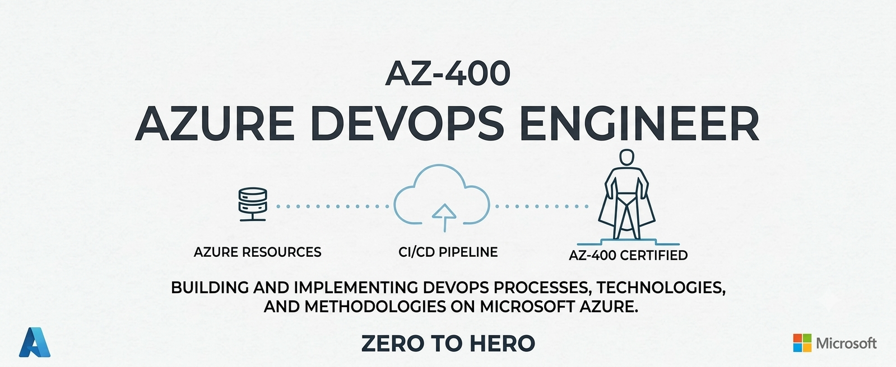

  

 

# Azure DevOps — Zero to Hero

### 🚀 From Azure DevOps fundamentals to advanced CI/CD, security, deployment automation, and enterprise DevOps — comprehensive explanations, hands-on labs, and real-world best practices.

---

## 📖 About This Repository

**Azure DevOps Zero to Hero** is a structured, project-based learning repository designed to take you from understanding the fundamentals of Azure DevOps to designing and implementing secure, scalable, automated, and production-ready DevOps solutions using Microsoft Azure.

This repository focuses specifically on **Azure DevOps and the AZ-400 certification objectives**, with practical coverage of Azure Boards, Azure Repos, Azure Pipelines, Azure Test Plans, Azure Artifacts, security, deployment strategies, infrastructure as code, monitoring, and GitHub integration.

Every section is organized into its own folder with a dedicated `README.md` covering in-depth explanations, architecture diagrams, Azure DevOps configurations, YAML examples, Azure Portal walkthroughs where applicable, CLI commands, hands-on labs, and real-world scenarios.

The content progresses logically — from Azure DevOps fundamentals and work tracking to source control, CI/CD pipelines, automated testing, package management, deployment strategies, security and compliance, infrastructure automation, monitoring, and enterprise-grade DevOps practices.

By the end of this course, you will be able to:

- ✅ Understand the Azure DevOps platform, its core services, organization structure, projects, and enterprise capabilities
- ✅ Plan, track, and manage development work using **Azure Boards**, backlogs, sprints, queries, dashboards, and work-item traceability
- ✅ Manage source code using **Azure Repos**, branching strategies, pull requests, branch policies, permissions, and repository security
- ✅ Design and implement automated CI/CD workflows using **Azure Pipelines**
- ✅ Build advanced **YAML pipelines** using stages, jobs, steps, tasks, variables, parameters, expressions, conditions, and templates
- ✅ Configure Microsoft-hosted and self-hosted **Azure DevOps agents**, agent pools, environments, approvals, checks, and service connections
- ✅ Implement automated testing, quality gates, test results, and code coverage using **Azure Test Plans** and Azure Pipelines
- ✅ Manage application packages and dependencies using **Azure Artifacts**, feeds, views, and upstream sources
- ✅ Implement secure authentication and authorization using **Microsoft Entra ID, managed identities, service principals, service connections, and workload identity federation**
- ✅ Protect secrets and sensitive information using **Azure Key Vault, secret variables, variable groups, and secure files**
- ✅ Implement secure DevOps practices using code scanning, dependency scanning, secret scanning, and **GitHub Advanced Security**
- ✅ Implement modern deployment strategies including **rolling, blue-green, canary, ring, progressive exposure, feature flags, and deployment slots**
- ✅ Automate Azure infrastructure deployments using **ARM templates, Bicep, Azure Automation, and Azure DevOps pipelines**
- ✅ Integrate Azure DevOps with **GitHub, GitHub Actions, and GitHub Advanced Security**
- ✅ Monitor applications, infrastructure, pipelines, and deployments using **Azure Monitor, Application Insights, and KQL**
- ✅ Design enterprise-grade Azure DevOps architectures with reusable pipelines, governance, security, multi-environment deployments, and automation
- ✅ Build real-world Azure DevOps projects that demonstrate practical CI/CD, DevSecOps, infrastructure automation, deployment, and monitoring
- ✅ Prepare systematically for the **AZ-400: Designing and Implementing Microsoft DevOps Solutions** certification

---

# 📚 Table of Contents

## 1. Azure DevOps Processes and Communications

This section covers planning, tracking, traceability, DevOps metrics, documentation, feedback, and collaboration across Azure DevOps and GitHub.

📂 **[Explore → Azure DevOps Processes and Communications](./1.%20Azure%20DevOps%20Processes%20and%20Communications/)**

| # | Sub-Topic | Description |
|---|-----------|-------------|
| 1.1 | [Flow of Work](./1.%20Azure%20DevOps%20Processes%20and%20Communications/1.1%20Flow%20of%20Work/) | Understand how work flows from planning through development, testing, deployment, and operations. |
| 1.2 | [GitHub Flow](./1.%20Azure%20DevOps%20Processes%20and%20Communications/1.2%20GitHub%20Flow/) | Understand GitHub Flow and how it supports continuous delivery. |
| 1.3 | [Feedback Cycles and Notifications](./1.%20Azure%20DevOps%20Processes%20and%20Communications/1.3%20Feedback%20Cycles%20and%20Notifications/) | Implement feedback loops using notifications, issues, and development workflows. |
| 1.4 | [Work Tracking](./1.%20Azure%20DevOps%20Processes%20and%20Communications/1.4%20Work%20Tracking/) | Track work using Azure Boards, GitHub Issues, GitHub Projects, and repositories. |
| 1.5 | [Traceability](./1.%20Azure%20DevOps%20Processes%20and%20Communications/1.5%20Traceability/) | Connect requirements, work items, source code, bugs, builds, tests, releases, and deployments. |
| 1.6 | [DevOps Metrics, Dashboards and Queries](./1.%20Azure%20DevOps%20Processes%20and%20Communications/1.6%20DevOps%20Metrics%20Dashboards%20and%20Queries/) | Measure cycle time, time to recovery, lead time, and appropriate metrics and queries for project planning, development, testing, security, delivery, and operations. |
| 1.7 | [Documentation and Wikis](./1.%20Azure%20DevOps%20Processes%20and%20Communications/1.7%20Documentation%20and%20Wikis/) | Create project documentation using Azure DevOps Wiki, Markdown, and Mermaid. |
| 1.8 | [Release Notes and API Documentation](./1.%20Azure%20DevOps%20Processes%20and%20Communications/1.8%20Release%20Notes%20and%20API%20Documentation/) | Create and maintain release notes and API documentation. |
| 1.9 | [Automated Documentation](./1.%20Azure%20DevOps%20Processes%20and%20Communications/1.9%20Automated%20Documentation/) | Automate documentation generation from Git history and development activity. |
| 1.10 | [Webhooks and DevOps Integrations](./1.%20Azure%20DevOps%20Processes%20and%20Communications/1.10%20Webhooks%20and%20DevOps%20Integrations/) | Integrate Azure DevOps and GitHub with external systems using webhooks and integrations. |
| 1.11 | [Azure Boards and GitHub Integration](./1.%20Azure%20DevOps%20Processes%20and%20Communications/1.11%20Azure%20Boards%20and%20GitHub%20Integration/) | Connect Azure Boards with GitHub repositories and development workflows. |
| 1.12 | [Microsoft Teams Integration](./1.%20Azure%20DevOps%20Processes%20and%20Communications/1.12%20Microsoft%20Teams%20Integration/) | Integrate Azure DevOps and GitHub notifications and collaboration with Microsoft Teams. |

---

## 2. Azure Repos and Source Control

This section covers Git-based source control, branching strategies, pull requests, repository management, permissions, large files, and advanced Git operations.

📂 **[Explore → Azure Repos and Source Control](./2.%20Azure%20Repos%20and%20Source%20Control/)**

| # | Sub-Topic | Description |
|---|-----------|-------------|
| 2.1 | [Azure Repos and Git Fundamentals](./2.%20Azure%20Repos%20and%20Source%20Control/2.1%20Azure%20Repos%20and%20Git%20Fundamentals/) | Understand Azure Repos, Git repositories, commits, branches, merges, and source-control workflows. |
| 2.2 | [Branching Strategies](./2.%20Azure%20Repos%20and%20Source%20Control/2.2%20Branching%20Strategies/) | Compare and implement trunk-based, feature-branch, and release-branch strategies. |
| 2.3 | [Pull Requests and Branch Policies](./2.%20Azure%20Repos%20and%20Source%20Control/2.3%20Pull%20Requests%20and%20Branch%20Policies/) | Configure pull requests, branch protection, reviewers, build validation, status checks, and merge restrictions. |
| 2.4 | [Repository Management](./2.%20Azure%20Repos%20and%20Source%20Control/2.4%20Repository%20Management/) | Manage repositories, permissions, tags, and repository-level configuration. |
| 2.5 | [Large Files with Git LFS and git-fat](./2.%20Azure%20Repos%20and%20Source%20Control/2.5%20Large%20Files%20with%20Git%20LFS%20and%20git-fat/) | Manage large files and binary content in Git repositories. |
| 2.6 | [Repository Scaling and Optimization](./2.%20Azure%20Repos%20and%20Source%20Control/2.6%20Repository%20Scaling%20and%20Optimization/) | Optimize Git repositories for large-scale development using techniques such as Scalar. |
| 2.7 | [Cross-Repository Sharing](./2.%20Azure%20Repos%20and%20Source%20Control/2.7%20Cross-Repository%20Sharing/) | Share and manage source code across multiple repositories. |
| 2.8 | [Git Data Recovery](./2.%20Azure%20Repos%20and%20Source%20Control/2.8%20Git%20Data%20Recovery/) | Recover lost commits, branches, and other Git repository data. |
| 2.9 | [Removing Sensitive Data from Git](./2.%20Azure%20Repos%20and%20Source%20Control/2.9%20Removing%20Sensitive%20Data%20from%20Git/) | Remove sensitive or unwanted information from source-control history. |

---

## 3. Azure Pipelines and Build & Release

This is the largest section because Build and Release Pipelines represents the largest portion of the AZ-400 exam.

📂 **[Explore → Azure Pipelines and Build & Release](./3.%20Azure%20Pipelines%20and%20Build%20%26%20Release/)**

| # | Sub-Topic | Description |
|---|-----------|-------------|
| 3.1 | [Package Management](./3.%20Azure%20Pipelines%20and%20Build%20%26%20Release/3.1%20Package%20Management/) | Manage application packages using Azure Artifacts and GitHub Packages. |
| 3.2 | [Feeds, Views and Upstream Sources](./3.%20Azure%20Pipelines%20and%20Build%20%26%20Release/3.2%20Feeds%20Views%20and%20Upstream%20Sources/) | Configure package feeds, views, and upstream sources. |
| 3.3 | [Package and Artifact Versioning](./3.%20Azure%20Pipelines%20and%20Build%20%26%20Release/3.3%20Package%20and%20Artifact%20Versioning/) | Apply SemVer, CalVer, and pipeline artifact versioning strategies. |
| 3.4 | [Testing Strategy and Quality Gates](./3.%20Azure%20Pipelines%20and%20Build%20%26%20Release/3.4%20Testing%20Strategy%20and%20Quality%20Gates/) | Design testing strategies and implement quality, security, and governance gates. |
| 3.5 | [Automated Testing](./3.%20Azure%20Pipelines%20and%20Build%20%26%20Release/3.5%20Automated%20Testing/) | Implement local, unit, integration, and load testing in pipelines, including test tasks, test agents, and test results. |
| 3.6 | [Test Results and Code Coverage](./3.%20Azure%20Pipelines%20and%20Build%20%26%20Release/3.6%20Test%20Results%20and%20Code%20Coverage/) | Publish and analyze test results and measure code coverage. |
| 3.7 | [Azure Pipelines and GitHub Actions](./3.%20Azure%20Pipelines%20and%20Build%20%26%20Release/3.7%20Azure%20Pipelines%20and%20GitHub%20Actions/) | Compare and implement CI/CD workflows using Azure Pipelines and GitHub Actions. |
| 3.8 | [Agents and Runners](./3.%20Azure%20Pipelines%20and%20Build%20%26%20Release/3.8%20Agents%20and%20Runners/) | Configure Microsoft-hosted, self-hosted, and GitHub-hosted execution infrastructure. |
| 3.9 | [Agent Pools and Runner Infrastructure](./3.%20Azure%20Pipelines%20and%20Build%20%26%20Release/3.9%20Agent%20Pools%20and%20Runner%20Infrastructure/) | Design agent pools and runner infrastructure based on cost, tools, connectivity, licensing, and maintenance. |
| 3.10 | [GitHub and Azure Pipelines Integration](./3.%20Azure%20Pipelines%20and%20Build%20%26%20Release/3.10%20GitHub%20and%20Azure%20Pipelines%20Integration/) | Integrate GitHub repositories with Azure Pipelines. |
| 3.11 | [Pipeline Triggers](./3.%20Azure%20Pipelines%20and%20Build%20%26%20Release/3.11%20Pipeline%20Triggers/) | Configure CI, pull-request, scheduled, and pipeline-completion triggers. |
| 3.12 | [YAML Pipeline Structure](./3.%20Azure%20Pipelines%20and%20Build%20%26%20Release/3.12%20YAML%20Pipeline%20Structure/) | Build YAML pipelines using stages, jobs, steps, tasks, and execution dependencies. |
| 3.13 | [Parallelism and Pipeline Dependencies](./3.%20Azure%20Pipelines%20and%20Build%20%26%20Release/3.13%20Parallelism%20and%20Pipeline%20Dependencies/) | Control execution order, dependencies, and parallel pipeline execution. |
| 3.14 | [Hybrid Pipelines and VM Templates](./3.%20Azure%20Pipelines%20and%20Build%20%26%20Release/3.14%20Hybrid%20Pipelines%20and%20VM%20Templates/) | Design complex hybrid pipelines, VM templates, and self-hosted runner or agent environments. |
| 3.15 | [Reusable Pipeline Components](./3.%20Azure%20Pipelines%20and%20Build%20%26%20Release/3.15%20Reusable%20Pipeline%20Components/) | Create reusable YAML templates and task groups. |
| 3.16 | [Variables, Parameters, Expressions and Variable Groups](./3.%20Azure%20Pipelines%20and%20Build%20%26%20Release/3.16%20Variables%20Parameters%20Expressions%20and%20Variable%20Groups/) | Use variables, parameters, expressions, conditions, and variable groups in reusable pipelines. |
| 3.17 | [Environments, Approvals and Checks](./3.%20Azure%20Pipelines%20and%20Build%20%26%20Release/3.17%20Environments%20Approvals%20and%20Checks/) | Protect deployment environments using approvals and automated checks. |
| 3.18 | [Deployment Strategies](./3.%20Azure%20Pipelines%20and%20Build%20%26%20Release/3.18%20Deployment%20Strategies/) | Implement blue-green, canary, ring, rolling, and progressive deployment strategies. |
| 3.19 | [Feature Flags and A/B Testing](./3.%20Azure%20Pipelines%20and%20Build%20%26%20Release/3.19%20Feature%20Flags%20and%20A-B%20Testing/) | Control feature exposure using feature flags and A/B testing. |
| 3.20 | [Deployment Ordering and Dependencies](./3.%20Azure%20Pipelines%20and%20Build%20%26%20Release/3.20%20Deployment%20Ordering%20and%20Dependencies/) | Manage deployment dependencies and component ordering. |
| 3.21 | [Zero-Downtime Deployments](./3.%20Azure%20Pipelines%20and%20Build%20%26%20Release/3.21%20Zero-Downtime%20Deployments/) | Minimize downtime using load balancing, rolling deployments, and deployment slots. |
| 3.22 | [Hotfix and Resilient Deployments](./3.%20Azure%20Pipelines%20and%20Build%20%26%20Release/3.22%20Hotfix%20and%20Resilient%20Deployments/) | Design emergency hotfix paths and resilient deployment workflows. |
| 3.23 | [Azure App Configuration Feature Management](./3.%20Azure%20Pipelines%20and%20Build%20%26%20Release/3.23%20Azure%20App%20Configuration%20Feature%20Management/) | Manage feature flags using Azure App Configuration Feature Manager. |
| 3.24 | [Container Deployments](./3.%20Azure%20Pipelines%20and%20Build%20%26%20Release/3.24%20Container%20Deployments/) | Build and deploy containerized applications through CI/CD pipelines. |
| 3.25 | [Kubernetes and AKS Deployment](./3.%20Azure%20Pipelines%20and%20Build%20%26%20Release/3.25%20Kubernetes%20and%20AKS%20Deployment/) | Deploy container workloads to Kubernetes and AKS using CI/CD pipelines. |
| 3.26 | [Binary and Script Deployments](./3.%20Azure%20Pipelines%20and%20Build%20%26%20Release/3.26%20Binary%20and%20Script%20Deployments/) | Deploy applications using binaries and scripts. |
| 3.27 | [Database Deployment](./3.%20Azure%20Pipelines%20and%20Build%20%26%20Release/3.27%20Database%20Deployment/) | Automate database changes as part of application deployments. |
| 3.28 | [Configuration Management](./3.%20Azure%20Pipelines%20and%20Build%20%26%20Release/3.28%20Configuration%20Management/) | Select and implement configuration-management technologies. |
| 3.29 | [Infrastructure as Code](./3.%20Azure%20Pipelines%20and%20Build%20%26%20Release/3.29%20Infrastructure%20as%20Code/) | Design IaC strategies covering source control, testing, and deployment automation. |
| 3.30 | [ARM Templates and Bicep](./3.%20Azure%20Pipelines%20and%20Build%20%26%20Release/3.30%20ARM%20Templates%20and%20Bicep/) | Deploy Azure infrastructure using ARM templates and Bicep. |
| 3.31 | [Desired State Configuration](./3.%20Azure%20Pipelines%20and%20Build%20%26%20Release/3.31%20Desired%20State%20Configuration/) | Implement desired-state configuration using Azure Automation State Configuration, ARM, Bicep, and Azure Machine Configuration. |
| 3.32 | [Azure Deployment Environments](./3.%20Azure%20Pipelines%20and%20Build%20%26%20Release/3.32%20Azure%20Deployment%20Environments/) | Implement Azure Deployment Environments for on-demand self-service development environments. |
| 3.33 | [Pipeline Monitoring and Optimization](./3.%20Azure%20Pipelines%20and%20Build%20%26%20Release/3.33%20Pipeline%20Monitoring%20and%20Optimization/) | Monitor pipeline health, failure rate, duration, flaky tests, performance, reliability, and cost. |
| 3.34 | [Concurrency and Retention](./3.%20Azure%20Pipelines%20and%20Build%20%26%20Release/3.34%20Concurrency%20and%20Retention/) | Optimize pipeline concurrency and manage artifact and dependency retention. |
| 3.35 | [Classic to YAML Migration](./3.%20Azure%20Pipelines%20and%20Build%20%26%20Release/3.35%20Classic%20to%20YAML%20Migration/) | Migrate classic pipelines to YAML-based pipelines. |

---

## 4. Azure DevOps Security and Compliance

This section covers identity, authentication, authorization, secrets, workload identity, security scanning, and DevSecOps.

📂 **[Explore → Azure DevOps Security and Compliance](./4.%20Azure%20DevOps%20Security%20and%20Compliance/)**

| # | Sub-Topic | Description |
|---|-----------|-------------|
| 4.1 | [Identity, Authentication and Authorization](./4.%20Azure%20DevOps%20Security%20and%20Compliance/4.1%20Identity%20Authentication%20and%20Authorization/) | Understand authentication and authorization across Azure DevOps, GitHub, and Microsoft Entra ID. |
| 4.2 | [Service Principals and Managed Identities](./4.%20Azure%20DevOps%20Security%20and%20Compliance/4.2%20Service%20Principals%20and%20Managed%20Identities/) | Use service principals and system-assigned or user-assigned managed identities. |
| 4.3 | [GitHub Authentication](./4.%20Azure%20DevOps%20Security%20and%20Compliance/4.3%20GitHub%20Authentication/) | Understand GitHub Apps, GITHUB_TOKEN, and personal access tokens. |
| 4.4 | [Azure DevOps Authentication and Service Connections](./4.%20Azure%20DevOps%20Security%20and%20Compliance/4.4%20Azure%20DevOps%20Authentication%20and%20Service%20Connections/) | Secure Azure DevOps authentication using PATs and service connections. |
| 4.5 | [Permissions, Security Groups and Access Levels](./4.%20Azure%20DevOps%20Security%20and%20Compliance/4.5%20Permissions%20Security%20Groups%20and%20Access%20Levels/) | Manage GitHub and Azure DevOps permissions, security groups, stakeholder access, and collaborators. |
| 4.6 | [Projects and Teams](./4.%20Azure%20DevOps%20Security%20and%20Compliance/4.6%20Projects%20and%20Teams/) | Organize users and access through Azure DevOps projects and teams. |
| 4.7 | [Azure Key Vault and Secrets](./4.%20Azure%20DevOps%20Security%20and%20Compliance/4.7%20Azure%20Key%20Vault%20and%20Secrets/) | Secure secrets, keys, and certificates using Azure Key Vault. |
| 4.8 | [Pipeline Secret Management](./4.%20Azure%20DevOps%20Security%20and%20Compliance/4.8%20Pipeline%20Secret%20Management/) | Manage secret variables, variable groups, secure files, and prevent secret leakage. |
| 4.9 | [Workload Identity Federation and OIDC](./4.%20Azure%20DevOps%20Security%20and%20Compliance/4.9%20Workload%20Identity%20Federation%20and%20OIDC/) | Implement passwordless CI/CD authentication using workload identity federation and OIDC. |
| 4.10 | [DevSecOps Security Scanning](./4.%20Azure%20DevOps%20Security%20and%20Compliance/4.10%20DevSecOps%20Security%20Scanning/) | Implement dependency, code, secret, license, and container security scanning. |
| 4.11 | [Microsoft Defender for Cloud DevOps Security](./4.%20Azure%20DevOps%20Security%20and%20Compliance/4.11%20Microsoft%20Defender%20for%20Cloud%20DevOps%20Security/) | Configure Microsoft Defender for Cloud DevOps Security. |
| 4.12 | [GitHub Advanced Security](./4.%20Azure%20DevOps%20Security%20and%20Compliance/4.12%20GitHub%20Advanced%20Security/) | Implement GitHub Advanced Security for GitHub and Azure DevOps and integrate GHAS with Microsoft Defender for Cloud. |
| 4.13 | [CodeQL and Dependabot](./4.%20Azure%20DevOps%20Security%20and%20Compliance/4.13%20CodeQL%20and%20Dependabot/) | Automate container scanning, including CodeQL analysis in a container, and use Dependabot alerts for open-source component vulnerabilities. |

---

## 5. Azure DevOps Instrumentation and Monitoring

This section covers telemetry, application monitoring, infrastructure monitoring, distributed tracing, DevOps monitoring, alerts, and KQL.

📂 **[Explore → Azure DevOps Instrumentation and Monitoring](./5.%20Azure%20DevOps%20Instrumentation%20and%20Monitoring/)**

| # | Sub-Topic | Description |
|---|-----------|-------------|
| 5.1 | [Azure Monitor](./5.%20Azure%20DevOps%20Instrumentation%20and%20Monitoring/5.1%20Azure%20Monitor/) | Monitor Azure resources, applications, and workloads and integrate monitoring with DevOps tools. |
| 5.2 | [Azure Monitor Logs](./5.%20Azure%20DevOps%20Instrumentation%20and%20Monitoring/5.2%20Azure%20Monitor%20Logs/) | Collect and analyze logs using Azure Monitor Logs. |
| 5.3 | [Application Insights](./5.%20Azure%20DevOps%20Instrumentation%20and%20Monitoring/5.3%20Application%20Insights/) | Monitor application performance and collect application telemetry. |
| 5.4 | [VM and Container Insights](./5.%20Azure%20DevOps%20Instrumentation%20and%20Monitoring/5.4%20VM%20and%20Container%20Insights/) | Monitor virtual machines and containerized workloads. |
| 5.5 | [Storage and Network Monitoring](./5.%20Azure%20DevOps%20Instrumentation%20and%20Monitoring/5.5%20Storage%20and%20Network%20Monitoring/) | Monitor Azure Storage and network performance using Azure Monitor. |
| 5.6 | [GitHub Insights and Charts](./5.%20Azure%20DevOps%20Instrumentation%20and%20Monitoring/5.6%20GitHub%20Insights%20and%20Charts/) | Analyze GitHub activity and development metrics using insights and charts. |
| 5.7 | [Azure Pipelines and GitHub Actions Monitoring](./5.%20Azure%20DevOps%20Instrumentation%20and%20Monitoring/5.7%20Azure%20Pipelines%20and%20GitHub%20Actions%20Monitoring/) | Monitor CI/CD workflows and configure alerts for GitHub Actions and Azure Pipelines. |
| 5.8 | [Infrastructure Performance Metrics](./5.%20Azure%20DevOps%20Instrumentation%20and%20Monitoring/5.8%20Infrastructure%20Performance%20Metrics/) | Analyze CPU, memory, disk, and network performance indicators. |
| 5.9 | [Application Performance and Telemetry](./5.%20Azure%20DevOps%20Instrumentation%20and%20Monitoring/5.9%20Application%20Performance%20and%20Telemetry/) | Analyze application performance and usage telemetry. |
| 5.10 | [Distributed Tracing](./5.%20Azure%20DevOps%20Instrumentation%20and%20Monitoring/5.10%20Distributed%20Tracing/) | Inspect distributed tracing using Azure Monitor Application Insights. |
| 5.11 | [KQL Fundamentals](./5.%20Azure%20DevOps%20Instrumentation%20and%20Monitoring/5.11%20KQL%20Fundamentals/) | Use basic Kusto Query Language queries to analyze logs and telemetry. |

---

## 6. Azure DevOps Real-World Projects

This section applies the concepts from the previous sections to complete Azure DevOps projects.

📂 **[Explore → Azure DevOps Real-World Projects](./6.%20Azure%20DevOps%20Real-World%20Projects/)**

| # | Project | Description |
|---|---------|-------------|
| 6.1 | [Azure Repos Source Control Project](./6.%20Azure%20DevOps%20Real-World%20Projects/6.1%20Azure%20Repos%20Source%20Control%20Project/) | Implement branching, pull requests, policies, and repository security. |
| 6.2 | [Complete CI Pipeline](./6.%20Azure%20DevOps%20Real-World%20Projects/6.2%20Complete%20CI%20Pipeline/) | Build a complete continuous integration pipeline with testing and artifacts. |
| 6.3 | [Multi-Stage YAML CI/CD](./6.%20Azure%20DevOps%20Real-World%20Projects/6.3%20Multi-Stage%20YAML%20CI-CD/) | Build a reusable multi-stage YAML pipeline. |
| 6.4 | [DevSecOps Pipeline](./6.%20Azure%20DevOps%20Real-World%20Projects/6.4%20DevSecOps%20Pipeline/) | Integrate security scanning, secrets, and quality gates. |
| 6.5 | [Container CI/CD](./6.%20Azure%20DevOps%20Real-World%20Projects/6.5%20Container%20CI-CD/) | Build, scan, publish, and deploy a containerized application. |
| 6.6 | [AKS CI/CD Deployment](./6.%20Azure%20DevOps%20Real-World%20Projects/6.6%20AKS%20CI-CD%20Deployment/) | Implement CI/CD deployment of a containerized application to AKS. |
| 6.7 | [Infrastructure as Code Pipeline](./6.%20Azure%20DevOps%20Real-World%20Projects/6.7%20Infrastructure%20as%20Code%20Pipeline/) | Deploy Azure infrastructure using Bicep and Azure Pipelines. |
| 6.8 | [Progressive Deployment Project](./6.%20Azure%20DevOps%20Real-World%20Projects/6.8%20Progressive%20Deployment%20Project/) | Implement blue-green, canary, or progressive deployment. |
| 6.9 | [Monitoring and Observability Project](./6.%20Azure%20DevOps%20Real-World%20Projects/6.9%20Monitoring%20and%20Observability%20Project/) | Implement Azure Monitor, Application Insights, alerts, and KQL. |
| 6.10 | [Enterprise Azure DevOps Project](./6.%20Azure%20DevOps%20Real-World%20Projects/6.10%20Enterprise%20Azure%20DevOps%20Project/) | Build an end-to-end enterprise DevOps solution combining CI/CD, security, IaC, deployment, and monitoring. |

---
